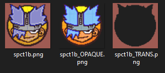
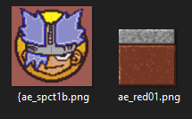

# info

- name/message: fur the color (159, 91, 83)
- map by rabbit
- for "Liminal Spaces Jam", hosted by CommonCold
- version: 2

## changelog

version 2

- fix softlock related to silver key in chaotically textured proto room (thanks CommonCold)

# credit

## sounds

- "aku aku"
  - https://www.myinstants.com/en/instant/aku-aku-crash-bandicoot/

## textures

- makkon trim guide textures, by kebby\_
  - the link only exists in the quake mapping discord, as far as i'm aware... but here is the message link to the `.wad`
    - https://discord.com/channels/464531227509260291/465241634683093023/1018655392831643658
- prototype textures, by khreathor
  - https://www.slipseer.com/index.php?resources/prototype-wad.263/
- makkon textures, by makkon
  - https://www.slipseer.com/index.php?resources/makkon-textures.28/
- quake101
  - https://www.quaddicted.com/files/wads/quakewad.zip
- rayman 2
  - https://www.textures-resource.com/pc_computer/rayman2thegreatescape/
- spyro 2
  - https://www.spyroforum.com/viewtopic.php?pid=450020
- crash bandicoot 2
  - https://www.textures-resource.com/playstation/crashbandicoot2cortexstrikesback/texture/5844/
- ape escape
  - https://www.smwcentral.net/?p=section&a=details&id=15684
- minecraft 1.20.6
  - ripped by me (see [below](#ripping-minecraft-textures) for how)
- rabbit emoji
  - from "Google Noto Color Emoji (2013-2023)"
  - https://emojipedia.org/google
- screenshots
  - taken by me in various programs (VS Code, TrenchBroom, Obsidian.md, google sheets, [ericw docs](https://ericwa.github.io/ericw-tools/doc/light.html), [mun.la](https://mun.la), notepad++, etc...)

## skyboxes

- "Cold Coastal Skybox Textures" by Jasper Carmack on gamebanana
  - https://gamebanana.com/mods/6897
- spyro skybox by rabbit, made using "Vertex Skybox Editor" by rubberrabbit
  - http://www.spyrofanworks.com/tools/skyboxeditor
  - https://www.romhacking.net/utilities/1520/

## music

- track 65:
  - name: "Aquatos - Sewer"
  - by: "David Bergeaud"
  - from: "Ratchet & Clank: Up Your Arsenal"
- track 66:
  - name: "Ion Storm"
  - by: "Frank Klepacki"
  - from: "Command & Conquer: Tiberian Sun"

## secret messages

1. "Til the Day we Die" by Sam Haft, from Helluva Boss
1. "Whatever It Takes" by Sam Haft & Andrew Underberg, from Hazbin Hotel
1. "Skipping Stone" by AJJ, from Operation Stackola
1. "I Love You for Psychological Reasons" by They Might Be Giants, from Dial-A-song Direct
1. "Chinchilla" by Cub, from Betti-Cola
1. "Haiku" by Tally Hall, from Marvin’s Marvelous Mechanical Museum
1. "Honeybee" by Steam Powered Giraffe, from The 2¢ Show
1. "Continue" by Kitsune², from I Kind of Really Want to Make Love to You
1. "The Too Much Song" by Lemon Demon, from Dinosaurchestra

# technical

- `.map` made in TrenchBroom (`TrenchBroom-Win64-v2024.1-Release`)
  - qbsp: `-splitturb -bsp2 mapsrc/${MAP_BASE_NAME}.map maps/${MAP_BASE_NAME}.bsp`
  - vis: `-noambient -threads ${CPU_COUNT - 1} maps/${MAP_BASE_NAME}.bsp`
  - light: `-extra4 -threads ${CPU_COUNT - 1} maps/${MAP_BASE_NAME}.bsp`
- `.bsp` compiled with ericw tools (`ericw-tools-v0.18.1-32-g6660c5f-win64`)
- tested in QuakeSpasm (`quakespasm-0.95.0_win64`)

## making a spyro skybox

- played around in Vertex Skybox Editor until i got something OK-ish
- split the exported `.png` image (4 tiles wide, 3 tiles tall) into 6 `.tga` images using a python script

## ripping minecraft textures

- downloaded an instance of version 1.20.6 via [PrismLauncher](https://prismlauncher.org/) 6.0
- open the `.jar` file in 7zip (mine was located at `N:\PrismLauncher-Windows-MSVC-Portable-6.0\libraries\com\mojang\minecraft\1.20.6\minecraft-1.20.6-client.jar`)
- extract the folders containing textures, like `assets\minecraft\textures\block`

## converting textures

- if they start as a tilemap or spritesheet, split it into individual images
  - some spritesheets are irregular, so i used this: https://github.com/ForkandBeard/Alferd-Spritesheet-Unpacker
  - otherwise i used this: https://ezgif.com/sprite-cutter
- the images need to be converted to work in quake, so...
  - _i used python for this, with the [Pillow](https://python-pillow.org/) package, mostly. using a script allows me to convert large folders of images very quickly_
  - convert image mode to `RBGA` (red, green, blue, alpha)
  - convert pixels with an alpha (tranparency) value less than 254 to the RGB tuple `(159, 91, 83)` -- this is the color value quake reserves for transparency. when the texture has `{` at the start of its name, it will be turned transparent instead of pink
  - split the image into 2 images: one containing only the quake-transparent pixels, the other containing only the non-quake-transparent pixels
    - example splitting:
      - 
  - palettize/quantize the quake-opaque image into the quake palette with the fullbright colors removed (we can slice it like this: `PALETTE[:224]`; quake has a 256-size color palette)
  - "alpha composite" the two images back together
  - remove the alpha channel (convert image from `RGBA` to `RGB`)
  - rename the image file
    - prepend a prefix, like `mc` to Minecraft texture or `ae` to Ape Escape textures
    - prepend a `{` if the image has quake transparency (as in, when we find the color `(159, 91, 83)` in the image)
    - pad the number at the end of the stem with a zero, or multiple zeroes. this keeps them in order in TrenchBroom, otherwise they get reordered like this: [`tile0`, `tile1`, `tile10`, `tile2`...]
      - the "stem" is part of a python `Path` object. an example: if the image is `images/tile.png` we can think of it like `parent/stem.suffix`
    - finally, save the image file 😃
    - example output:
      - 
- then i import into Wally, and export the `.wad` file (i made one file per game, so Spyro 2 has a `.wad`, Ape Escape has a `.wad`, Minecraft has a `.wad`, etc)
  - https://valvedev.info/tools/wally/
  - https://developer.valvesoftware.com/wiki/Wally
- for minecraft textures specifically, i also resized them (200%) with 'nearest neighbor' scaling. i probably should have done that with other games' textures but oops
- for screenshots or small textures, i had to resize or crop them to be divisible by 16

my python script is not public yet (the code is really messy, its not fully usable yet), but i will make a post in the quake discord when it is

## converting sound effects

- i used audacity to convert sounds into 16-bit mono `wav` files

# end of readme

_DON'T WORRY -- BE FURRY_

_...and stay hydrated_

🐇
